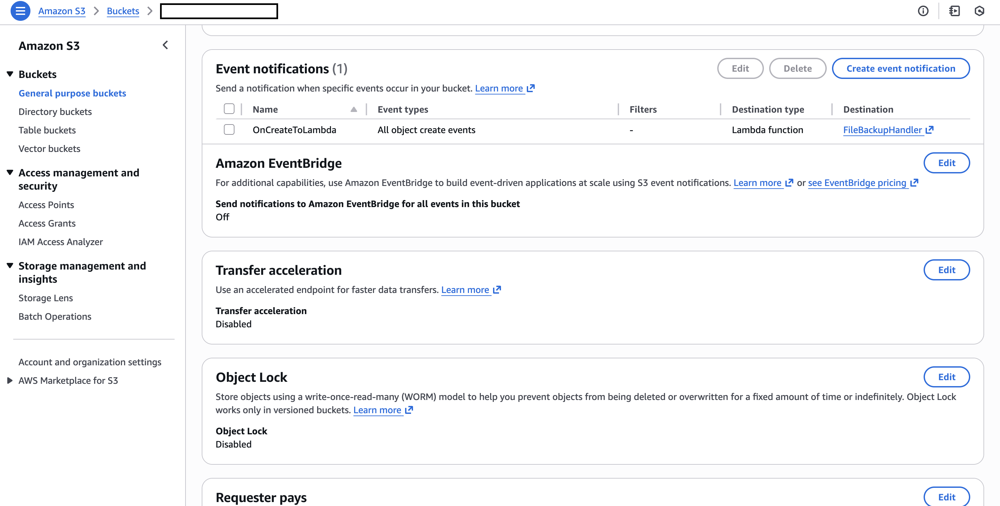
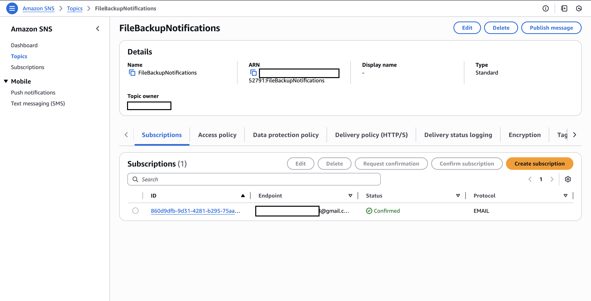
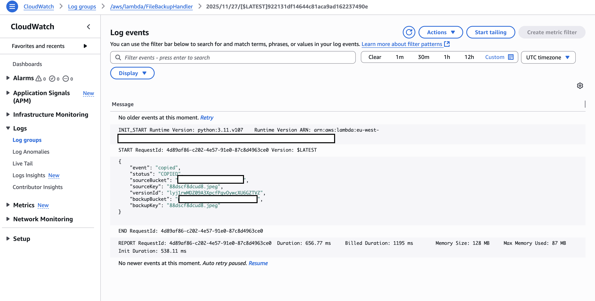

# File Backup System

## Goal

A Dropbox‑style personal backup on AWS (S3, Lambda, SNS).

Files uploaded into an S3 “inbox” bucket are copied to a backup bucket via a Lambda function, with an SNS email notification. Optionally log/audit activity with CloudTrail.

## Outcome

Event‑driven backup pipeline with notifications and audit trail.

## Resources Created

### IAM Roles

Custom IAM role for the lambda interactions with both S3 buckets and SNS.

[lambda-urlshortener-role.png](lambda-urlshortener-role.png)

### S3 Buckets

Two buckets, one for upload of files, another that stores the automated backups.

The upload bucket has an event notification to call the lambda function upon creation of new objects within the bucket.

### Lambda

One lambda that:
* Handles input events from S3 (upon object creations)
* Checks if the file already exists in backup S3
    * If not, then copies the file
    * Else skips the copy
* Publishes a new message to SNS with the copy details

### Simple Notification System (SNS)

Send email notifications with email subscriptions.

### CloudWatch

CloudWatch is used to capture logging for the lambda function.

