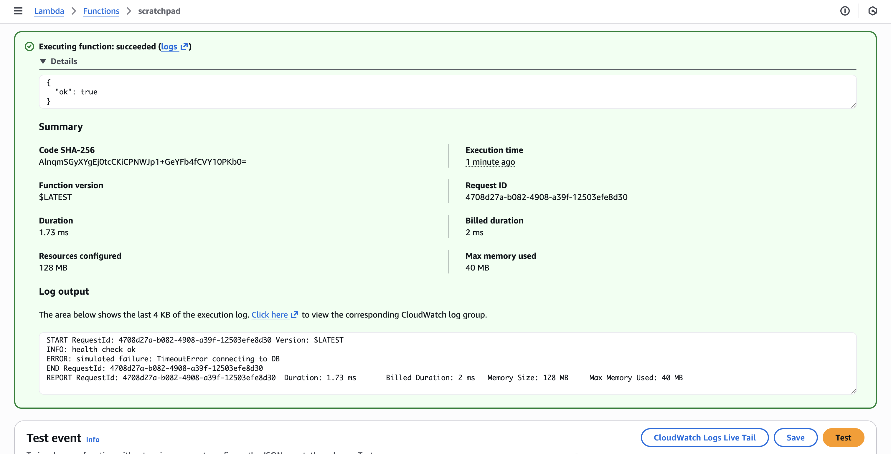
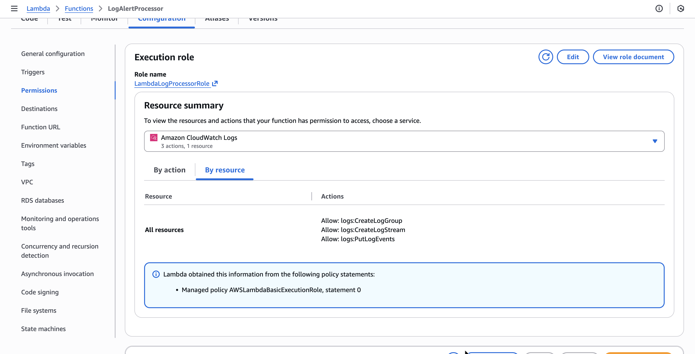
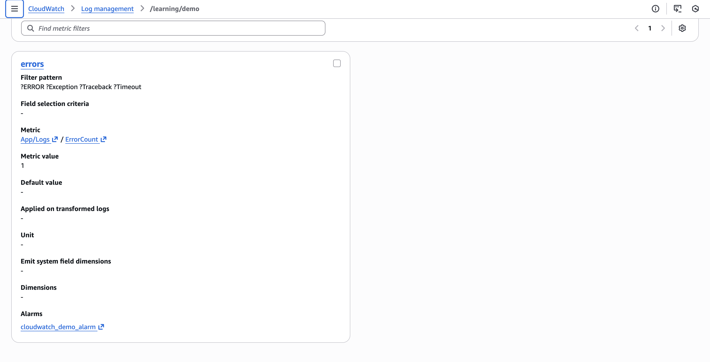
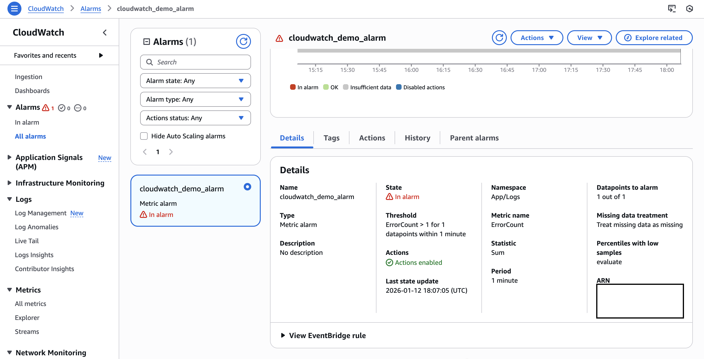
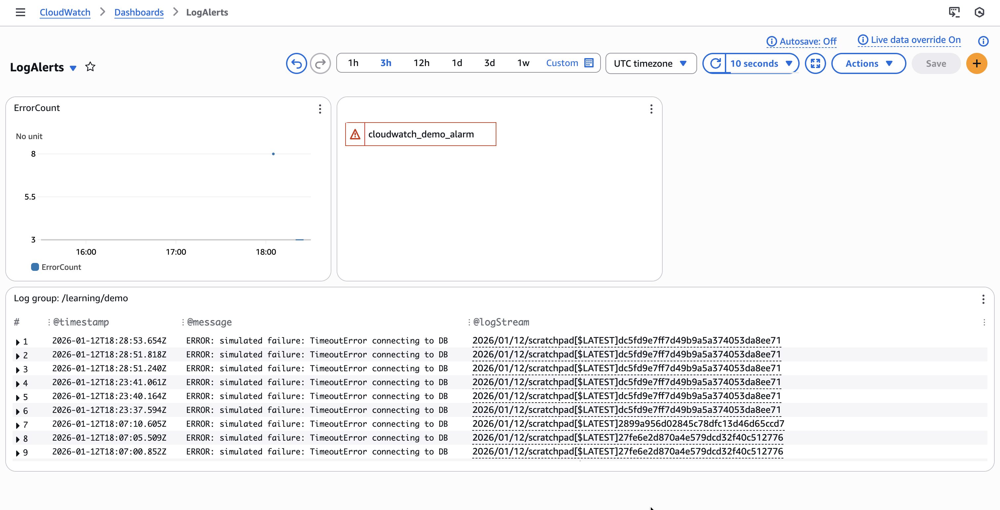

# RSS Subtack Feed to Meta Essay

## Goal

Detect errors logs in near‑real time, trigger alerts, and view live trends.

## Outcome

A CloudWatch‑driven pipeline with metric filters + alarms (SNS), a Lambda log processor that writes incidents to DynamoDB, and a CloudWatch Dashboard.

## Resources Created

### IAM Roles

Custom IAM roles for the lambdas interactions with CloudWatch and with DynamoDB.

### DynamoDB

One table to store the error logs.

### Lambda

One lambda for:

* Generating mock app health logs
* This sends the telemetry to a CloudWatch log group

One lamdba for:
* Parsing the error logs filtered by the CloudWatch filter and writing to DynamoDB

### CloudWatch Log Groups

A group to funnel the logs into, including a filter for errors specifically which are then funneled to a lambda to process them.

### SNS (Simple Notification System)

Boilerplate SNS email notification to notify users by email when the error threhsold is exceeded.

### Dashboard

And finally a dashboard to visualize the error telemetry.

