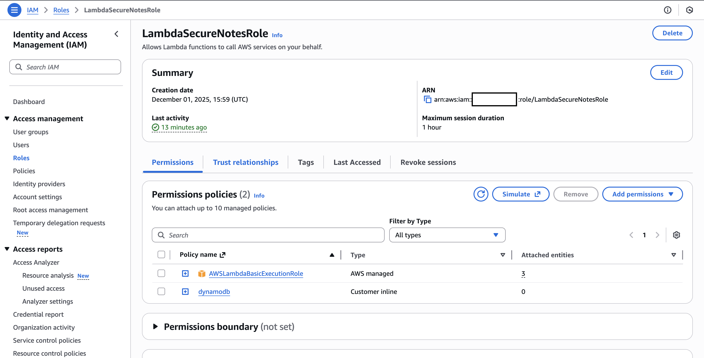

# Notes App

## Goal

A login‑protected notes API where users authenticate with Amazon Cognito and perform CRUD on notes via API Gateway + Lambda + DynamoDB.

## Outcome

A multi‑user, token‑secured backend with per‑user data isolation (JWT → authorizer → Lambda → DynamoDB).

## Resources Created

### Cognito User Pool

A user pool to handle:

* Self-registration of new users
* Authentication of existing users
* Handling of JWT in the API endpoints

The user portal was set up as the default AWS portal - not a custom domain / app.
And for the authentication, it was set as USER_PASSWORD_AUTH with email verification.


### DynamoDB

A single table partitioned by the user id to store their notes, ensuring isolation per-user.


### IAM Roles

Custom IAM role for the lambda interactions with DynamoDB.



### Lambda

Lambda function to handle all the API endpoints and respective interactions with DynamoDB.

[SecureNotesHandler.py](SecureNotesHandler.py)

### REST API

API to handle CRUD functionality for notes, i.e., user-partioned records in DynamoDB.

The endpoints and respective methods available are:

* /notes
    * GET: List all notes for the user
    * POST: Create a new note

* /notes/{note_id}
    * GET: Get a note
    * PUT: Update a note
    * DELETE: Delete a note


### Test commands

#### Sign up user

This will send the user a confirmation email with a code.

```bash
aws cognito-idp sign-up \
  --region <REGION> \
  --client-id <APP_CLIENT_ID> \
  --username you@example.com \
  --password 'ExamplePass#123'
```

#### Confirm sign up

```bash
aws cognito-idp confirm-sign-up \
  --region <REGION> \
  --client-id <APP_CLIENT_ID> \
  --username you@example.com \
  --confirmation-code <CODE_FROM_EMAIL>
```

#### Generate secret hash for sign in

```bash
echo -n "test@mail.com<client-id>" | openssl dgst -sha256 -hmac "<client-secret>" -binary | base64
```

#### Sign in

The token of interest for API interaction is the IdToken.

```bash
aws cognito-idp initiate-auth \
  --region <REGION> \
  --client-id <APP_CLIENT_ID> \
  --auth-flow USER_PASSWORD_AUTH \
  --auth-parameters USERNAME=you@example.com,PASSWORD='ExamplePass#123',SECRET_HASH='hash_value'
```

#### Create note

```bash
curl -sS -X POST \
  -H "Authorization: Bearer $TOKEN" -H "Content-Type: application/json" \
  -d '{"text":"First secure note"}' \
  https://<invoke-id>.execute-api.<region>.amazonaws.com/prod/notes
```

#### List all notes for user

```bash
curl -sS -H "Authorization: Bearer $TOKEN" \
  https://<invoke-id>.execute-api.<region>.amazonaws.com/prod/notes
```

#### Update note

```bash
curl -sS -X PUT \
  -H "Authorization: Bearer $TOKEN" -H "Content-Type: application/json" \
  -d '{"text":"Updated text"}' \
  https://<invoke-id>.execute-api.<region>.amazonaws.com/prod/notes/<noteId>
```

#### Get note

```bash
curl -sS -H "Authorization: Bearer $TOKEN" \
  https://<invoke-id>.execute-api.<region>.amazonaws.com/prod/notes/<noteId>
```

#### Delete note

```bash
curl -sS -X DELETE \
  -H "Authorization: Bearer $TOKEN" \
  https://<invoke-id>.execute-api.<region>.amazonaws.com/prod/notes/<noteId>
```