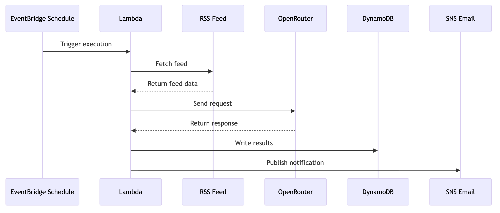
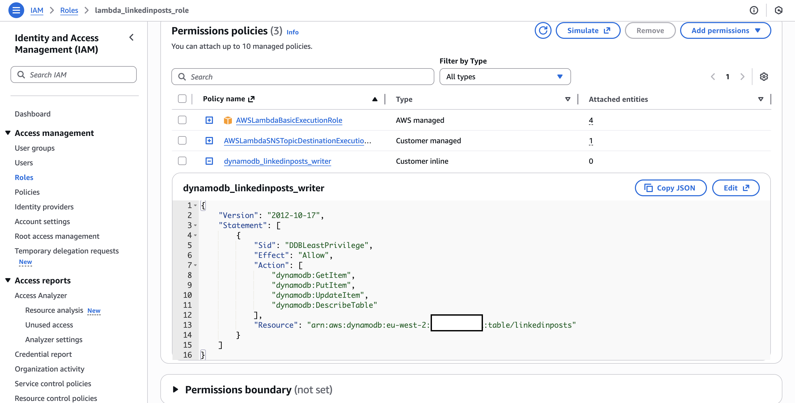
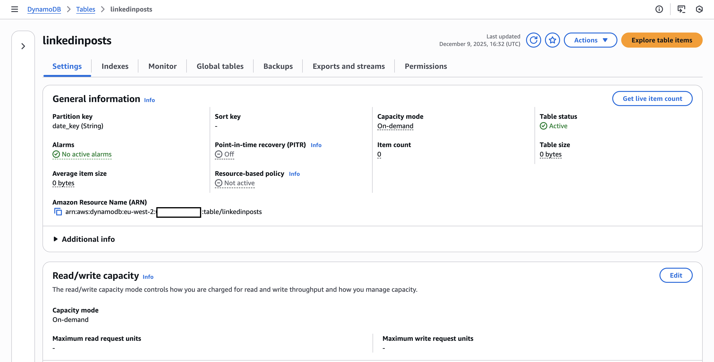
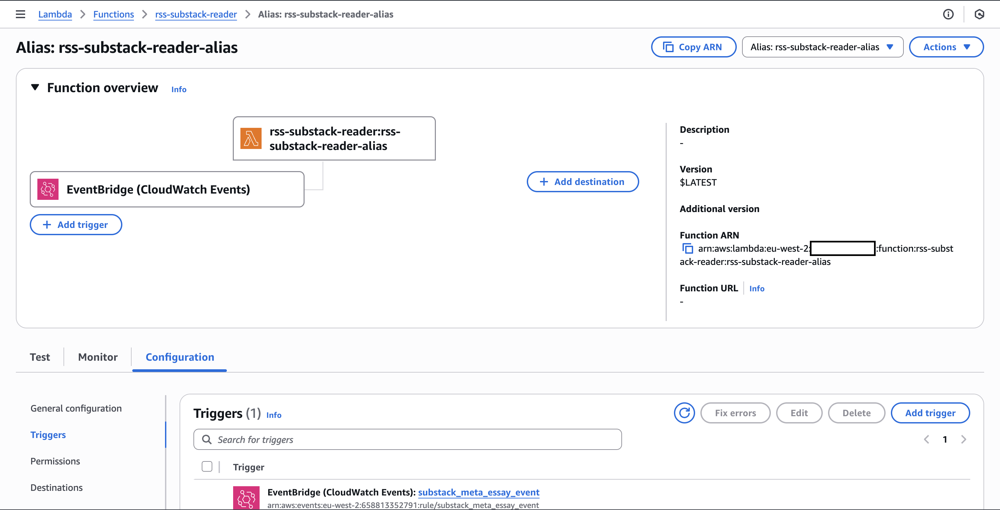
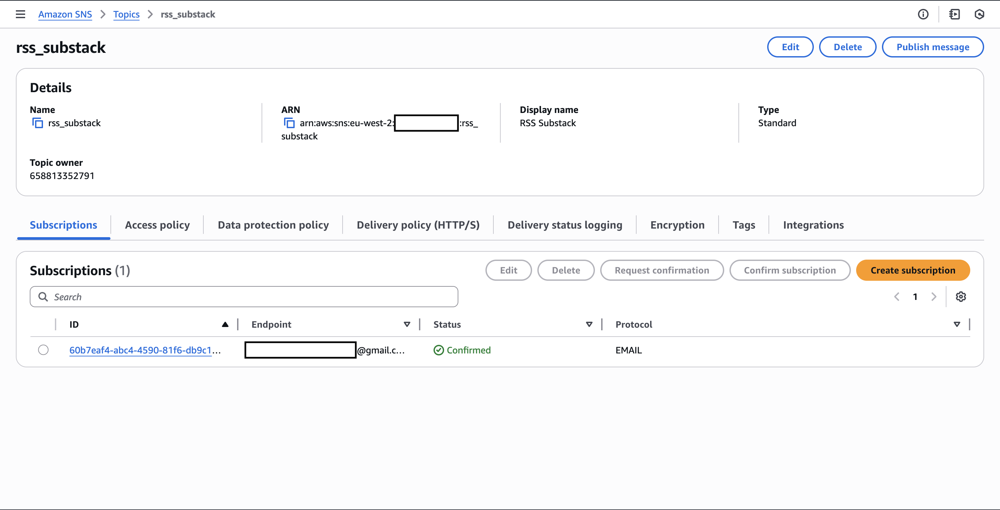

# RSS Subtack Feed to Meta Essay

## Goal

A weekly process that reads the latest 5 Substack posts from my feed and generates a new meta essay feed sent to me via email. 

## Outcome

Use a scheduled Lambda (via WatchLogs cron schedule) to fetch the RSS feed, parse the XML content, format a prompt to send to OpenRouter for an LLM to generate the new essay. Then, the result is a) persisted to DynamoDB and b) sent to myself via SNS email subscription.




## Resources Created

### IAM Roles

Custom IAM role for the lambdas interactions with DynamoDB.



### DynamoDB

One table to store the generated essays, partitioned by a date key (YYYYMMDD) because the process will run once per week only - even if it reran in the same due to e.g. a lambda retry, it's intended to see that record be overwritten in the table.



### Lambda

One lambda for:

* Fetching the RSS feed
* Parsing the XML (for the latest 5 posts)
* Calling OpenRouter to generate the essay
    * Store result in DynamoDB
    * Send result via SNS email subscription

The lambda's execution timeout was set to 1 minute due to the duration of OpenRouter's call (average of 32 seconds).

To simplify the publishing of new lambda versions, I also created an alias. Triggers (and destinations) are not included in the publishing and they are version-specific. The solution to avoid recreating them is to create an alias that points at the published lambda version, and attach the triggers to that alias. The alias can point at a specific lambda version of dynamically at the latest version - the latter was implemented here.

Code is available in [lambda.py](lambda.py).



#### Lambda Layers

One constraint with this lambda was the need to make additional library available during runtime. The solution is to create a new layer that includes a copy of these libraries and then link the lambda to this layer.

This layer is created from a .zip of your necessary libraries, which within must include a root folder python and the libraries within. A sample folder will look like this:

```mermaid
layer.zip
└── python/
    └── requests/
        └── (requests files here)
```

Or even 

```mermaid
layer.zip
└── python/
    └── lib/
        └── python3.14/
            └── site-packages/
                └── requests/
                    └── (requests files here)
```

Fundamentally, it needs to have that python folder at its root, the rest it's available to find on its own. Also important to note the libraries must be linux-compatible because that's where lambdas run.

For more on layers, visit the [documentation](https://docs.aws.amazon.com/lambda/latest/dg/python-layers.html).

Also note that a lambda will be pointing at a specific version of the layer - so if you upload a new .zip and generate a new layer version, you need to update the reference in the lambda.


### SNS (Simple Notification System)

Finally, there is a SNS topic and email subscription. This is a mechanism to send email with custom content, in this case for the lambda to send me the generated essay by email on top of already persisting it in DynamoDB.


