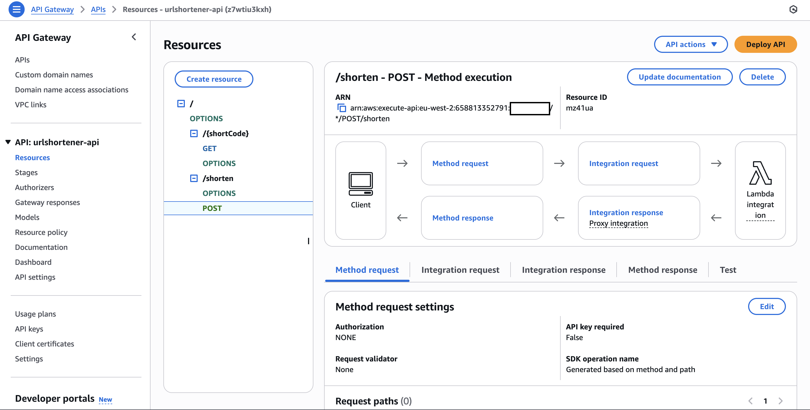

# URL Shortener

## Goal

Build a Bitly_style URL shortener on AWS using API Gateway + Lambda + DynamoDB.

## Outcome

A live API that creates short links (`POST /shorten`) and redirects them (`GET /{code}`).

## Resources Created

### IAM Roles

Custom IAM role for the lambdas interactions with DynamoDB.

### DynamoDB

One table to store generated URL short codes and original URLs.

### Lambda

One lambda for generating the URL short code (POST), and another to allow the redirect (GET).

Code for each lambda is available in  [urlshortener_redirect.py](urlshortener_shorten.py) and [urlshortener_redirect.py](urlshortener_redirect.py)

### API Gateway

A REST API created and supported by lambda proxies. Two endpoints created:

#### (POST) /shorten

Receives a URL, generates a record for the DynamoDB table with a new shortcode and returns the shortened URL

#### (GET) /{shortCode}

Receives the shortCode as a URL parameter, lookups the original URL in DynamoDB and redirects the user to it

